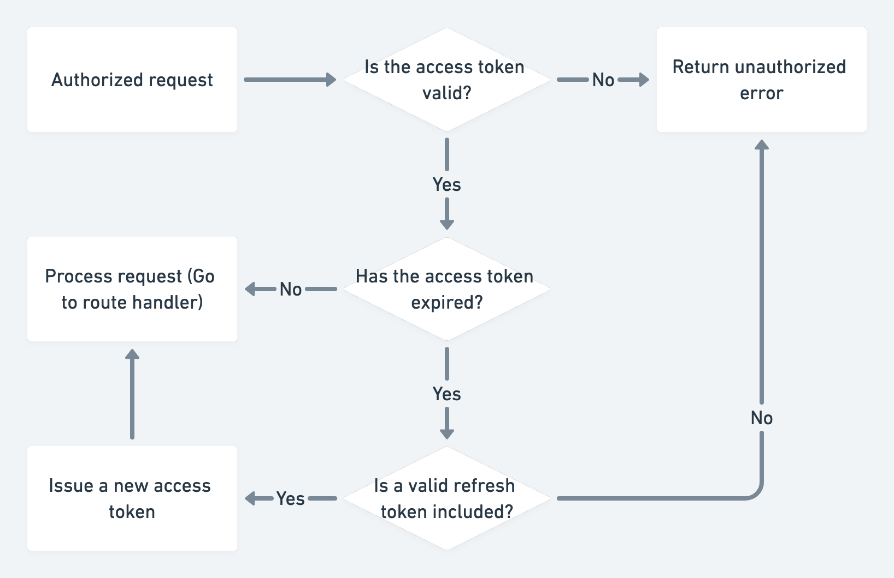

#REST API with Node.js, Mongoose & TypeScript

### With this API we can control user sessions utilizing JWT and manage products with basic CRUD operations.

## Data flow

## Access & refresh token flow

